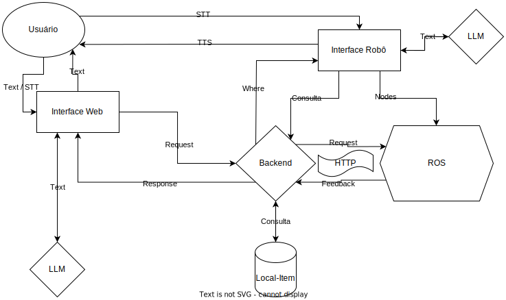

# Arquitetura versão 2 

Na sprint 3, decidimos trocar um pouco a arquitetura, pensando em formas melhores de controlar o robô e as requisições feitas ao longo do sistema.

 

 

O fluxo dessa nova arquitetura seguiria o seguinte percurso:

- O usuário entra em contato com o robô com um comando de voz ou texto por meio do módulo interface web ou por meio de um comando de voz ao robô com STT;
- O comando é processado pelo backend e, este, mediante confirmação do usuário, envia requisições HTTP para os nós do pacote ROS que inicializam a navegação do robô;
- No fim do processo de navegação, o sistema ROS retorna para o backend um relatório sobre a navegação do robô, permitindo a baixa dos itens guardados ou alguma outra mensagem de erro;
- Além disso, toda conversa com o robô ou com o chatbot passa pelo LLM utilizando o OPENAI para manter uma conversa que faça sentido dentro do contexto;
- O backend acessa um banco de dados com toda a relação de itens com suas respectivas posições no almoxarife.
