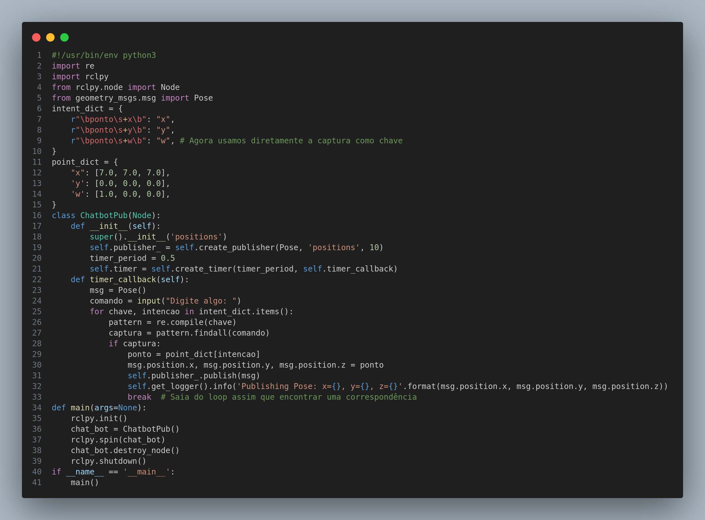

# Sistema de chatbot

Na sprint anterior, o objetivo era desenvolver um chat simples que utilizasse um publisher para enviar informações fornecidas por um usuário para um tópico chamado "positions" no código. O chat deveria ser criado na linha de comando (CLI), e as informações do usuário seriam processadas usando expressões regulares (regex) para extrair dados relevantes.

Foram definidas expressões regulares no dicionário chamado "intent_dict", onde cada expressão correspondia a uma intenção específica do usuário. Por exemplo, a expressão regular `r"\bponto\s+x\b"` estava associada à intenção "x". Essas intenções representavam os pedidos que os usuários poderiam fazer na plataforma.
Além disso, foi criado um dicionário chamado "point_dict" para associar pontos específicos a cada intenção. Cada intenção tinha um conjunto de pontos pré-definidos que seriam acionados como próxima movimentação do robô. Esses pontos eram fixos no almoxarifado, refletindo as restrições do ambiente.
O script incluí a classe "ChabotPub(Node)" dedicada à criação de um publisher ROS (Robot Operating System) para o tópico "positions". Esse tópico seria consumido por um script de navegação, permitindo a comunicação eficiente entre diferentes partes do sistema.

No entanto, na implementação anterior, houve dificuldades em integrar completamente essa solução, resultando na decisão de manter o script em um único arquivo. O ROS não foi utilizado, e em vez disso, uma lista de pontos foi passada diretamente ao robô simulado no Gazebo para seguir. Essa abordagem simplificada foi adotada temporariamente, mas o objetivo para a próxima sprint é reverter essa decisão.

A intenção é desacoplar o sistema, evitando a necessidade de incluir o ROS no mesmo arquivo e, assim, aumentar a eficiência do código. A ideia é retomar a implementação original, onde o publisher ROS seria utilizado para uma comunicação mais robusta e flexível entre os diferentes componentes do sistema. Isso permitiria uma integração mais eficiente e modular, melhorando a escalabilidade e manutenção do código.

 Script de chatbot usando subscriber e regex 

