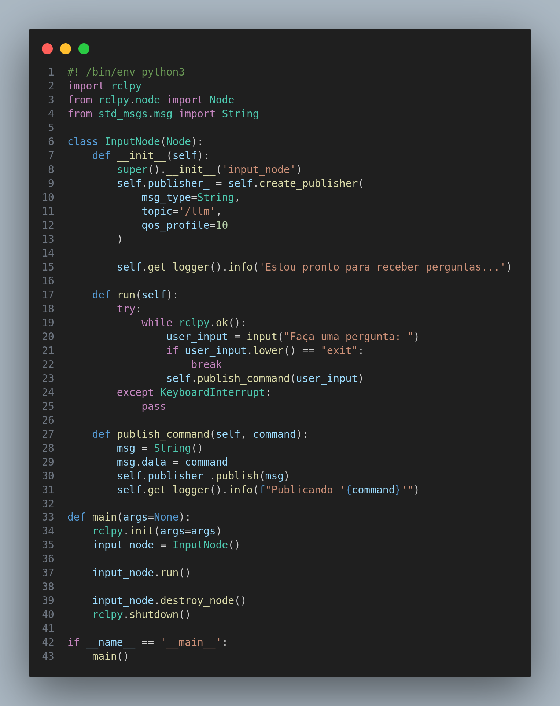
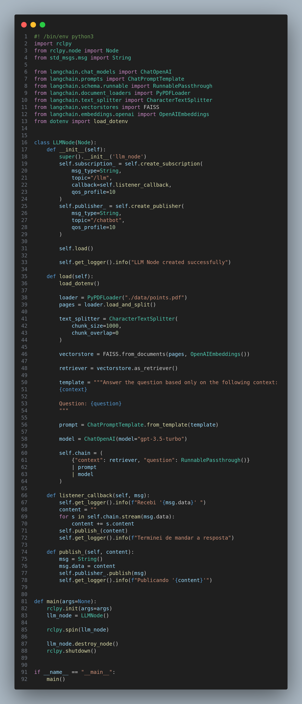
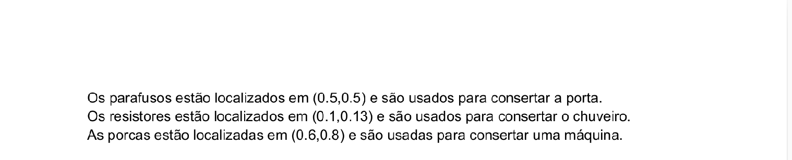
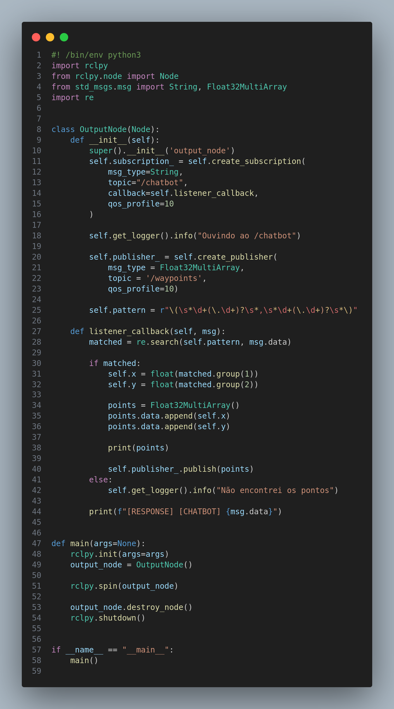

# Chatbot Integrado com LLM

Na Sprint 3, nosso objetivo era aprimorar a robustez do chatbot, implementando um sistema mais sofisticado. Introduzimos um mecanismo de publicação (publisher) e subscrição (subscriber), onde cada nó é responsável por uma única função, e os tópicos servem como meio de comunicação entre esses nós.

O processo de interação com o sistema começa com o nó de entrada, chamado "input", que solicita informações ao usuário por meio de uma interface de linha de comando (CLI). O usuário fornece um contexto para o chat, que é então publicado no tópico 'llm'.

Aqui está o script do nó de entrada do chatbot, cuja função é receber informações contextuais do usuário e publicá-las no tópico 'llm':

 Script de chatbot CLI para o usuário fornecer contexto 

Na segunda etapa, o nó "LLM" (Large Language Model) entra em cena. Ele se inscreve no tópico 'llm' para ouvir o contexto fornecido pelo usuário. Em seguida, submete esse contexto a uma análise por meio de um langchain que carrega o modelo LLM do GPT-3.5 fornecido pela OpenAI. Dentro do langchain, está contida a lógica de consulta em PDF, detalhada em uma seção posterior. A resposta obtida é publicada no tópico "chatbot".

 Script do nó LLM responsável pela implementação da lógica deentendimetno de contexto

O foco do PDF desenvolvido pelo grupo é fornecer três contextos simples e não ambíguos para que o usuário possa utilizá-los. Esses contextos são projetados para facilitar perguntas específicas, como sugestões sobre o que fazer com uma porta quebrada.

 PDF desenvolvido pelo grupo dando contexto e informações para consulta do LLM 

O nó "regex" processa as informações do usuário por meio de expressões regulares contidas no dicionário chamado "intent_dict". Cada expressão regular neste dicionário está vinculada a uma intenção específica do usuário, oferecendo uma estrutura organizada para compreender e atender às diversas solicitações dos usuários na plataforma.

Adicionalmente, criamos o dicionário "point_dict" para correlacionar pontos específicos a cada intenção. Cada intenção possui um conjunto predefinido de pontos, representando as próximas movimentações do robô no almoxarifado. Esses pontos refletem as restrições e características específicas do ambiente.

O script também incorpora a classe "ChatbotPub(Node)", projetada para estabelecer um publisher ROS (Robot Operating System) para o tópico "positions". Esse tópico é destinado a ser consumido por um script de navegação, permitindo uma comunicação eficaz entre os componentes do sistema e garantindo uma integração fluida e coordenada das operações do robô.

 Script do nó output responsável pelo regex e publicar pontos para movimentação

