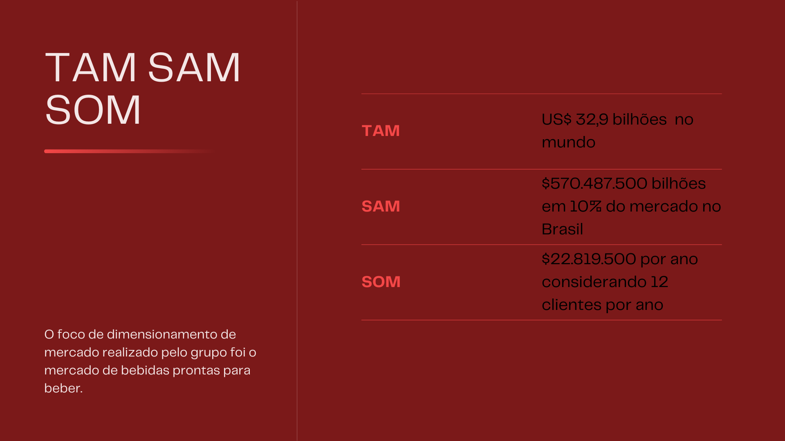

# TAM SAM SOM
Os conceitos de TAM, SAM e SOM são ferramentas valiosas para empreendedores ao analisar diferentes segmentos de um mercado e prever a demanda, vendas e crescimento de seus produtos ou serviços. Vamos aplicar esses conceitos ao contexto da Ambev, uma das maiores empresas de bebidas do mundo, que produz e distribui cervejas, refrigerantes e outras bebidas alcoólicas e não alcoólicas.
1. **TAM (Total Available Market - Mercado Total):**
 
O TAM representa a demanda total por produtos ou serviços em um mercado, sendo uma estimativa ampla e abrangente que frequentemente requer recursos substanciais em termos de vendas e distribuição, muitas vezes em escala global. Para calcular o TAM, somamos as receitas de todas as empresas que operam no mercado relevante. No caso da indústria de bebidas, o mercado abrange uma parcela significativa da indústria de transformação. Por exemplo, no setor de bebidas alcoólicas RTDs (ready-to-drink), estima-se que o mercado global movimentou US$32,9 bilhões no ano passado e deve atingir US$85,5 bilhões em 2030, o que impulsiona o setor no Brasil.
2. **SAM (Serviceable Available Market - Mercado Endereçável):**
 
O SAM representa a porção do TAM que uma empresa pode efetivamente alcançar, levando em consideração fatores como geografia, especificidades do produto e o crescimento do mercado. Este é um segmento mais focado e acessível a médio ou longo prazo, desde que a empresa tenha um modelo escalável. No caso da produção de cerveja no Brasil, que atingiu 14,3 bilhões de litros, gerando um mercado de R$77 bilhões anualmente e mais de 2 milhões de empregos diretos, a empresa pode se concentrar em conquistar uma parte desse mercado.
Para calcular o SAM, é necessário multiplicar o preço do produto pela quantidade real de clientes que o produto pode atingir, com base em uma análise financeira prévia.
No Brasil, a indústria de bebidas emprega mais de 120 mil pessoas em quase 3 mil empresas, e a maioria dos produtos fabricados no país é destinada ao consumo interno. A produção abrange desde refrigerantes, sucos e bebidas alcoólicas até água e xaropes. Como exemplo, suponhamos que 10% desse mercado adote a solução, o que resultaria em 300 empresas multiplicadas por $1.901.625, totalizando $570.487.500 como faturamento potencial no mercado brasileiro.
3. **SOM (Serviceable Obtainable Market - Mercado Acessível):**
 
O SOM representa a parte do SAM que o produto pode efetivamente conquistar, considerando fatores como concorrência, canais de distribuição, localização e influências externas. O SOM é o mercado mais realista para a empresa começar, com foco em uma persona ou cliente ideal específico. Para calcular o SOM, é necessário multiplicar o preço do produto pela quantidade real de clientes que a empresa pode atender em um período definido. Por exemplo, se a empresa atender 12 clientes em um ano, com o preço do produto é $1.901.625, o que resultaria em um faturamento de $22.819.500, sem considerar os gastos internos necessários para essa implementação, como por exemplo a arquitetura da solução que muda conforme o contexto do cliente.
 
Em resumo, o TAM representa o mercado total, o SAM é a parte desse mercado que a empresa pode abordar de maneira eficaz, e o SOM é a fração desse mercado que a empresa pode efetivamente conquistar, levando em consideração variáveis específicas e um planejamento estratégico adequado. Esses conceitos auxiliam os empreendedores na definição de estratégias de crescimento de forma mais precisa.
 
 

 Total Available Market, Serviceable Available Market, Serviceable Obtainable Market 

