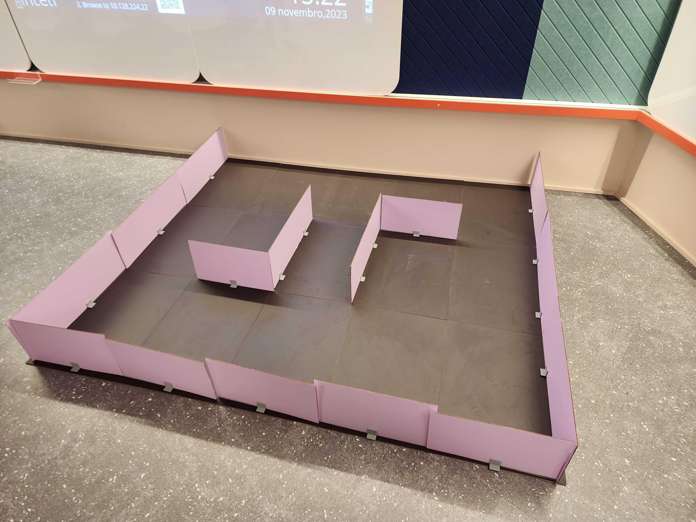

# Sistema de Localização e Mapeamento Simultâneo

Nesta seção, examinaremos a implementação conjunta do mapeamento e navegação do robô. O mapeamento desempenha um papel crucial ao permitir que o robô se desloque em ambientes desconhecidos, identificando obstáculos e registrando coordenadas relevantes no ambiente. Quanto à navegação, o robô é capaz de se dirigir a locais predefinidos por meio de comandos simples.

## Mapeamento

Na elaboração do mapeamento, aproveitamos as funcionalidades oferecidas pelas tecnologias Nav2 e Rviz, complementadas pelo nó turtlebot3 teleop. A execução desse processo envolve a inicialização das ferramentas de captura, onde a interação ocorre através do uso das teclas do computador para enviar comandos de navegação ao robô.

O turtlebot3 teleop desempenha um papel fundamental nesse contexto, permitindo o controle manual do robô durante a fase de mapeamento. Por meio dessa interação, o operador pode guiar o robô de forma estratégica pelo ambiente desejado. Essa abordagem interativa, baseada nas entradas do teclado, possibilita a exploração meticulosa de todo o espaço, capturando dados essenciais para a construção do mapeamento.

Adicionalmente, desenvolvemos um lançador de mapeamento, proporcionando a execução sequencial de vários nós ROS2. Essa abordagem simplifica significativamente a inicialização desse sistema, conferindo maior praticidade e eficiência à operação conjunta dos diferentes componentes envolvidos.

## Navegação

Para aprimorar a eficácia da navegação, desenvolvemos um nó responsável por inicializar o Nav2, desempenhando um papel crucial na coordenação da movimentação do robô. Em seguida, utilizamos o Simple Commander para guiar o robô até a posição inicial do mapa, simplificando o envio de comandos de movimentação.

Posteriormente, implementamos um chat por meio de linhas de comando, proporcionando ao usuário a capacidade de enviar pontos pré-determinados armazenados em um dicionário para fins de navegação. Essa interação flexível pode ser repetida, permitindo ao usuário adicionar diversos pontos até confirmar que não há mais destinos desejados.

Os pontos selecionados são registrados em uma lista, acessada posteriormente pelo Simple Commander. Este percorre a lista, enviando comandos de navegação para cada uma das posições definidas. Esse método intuitivo e adaptável não apenas simplifica a interação com o robô, mas também oferece uma abordagem flexível para explorar o ambiente de maneira precisa e personalizada.

## Conexão com o robô

Para estabelecer a conexão com o robô e enviar comandos, é imperativo acessar o terminal do robô por meio de uma conexão SSH. Em seguida, execute o comando a seguir:
```
ros2 launch turtlebot3_bringup robot.launch.py
```

## Preparativos para a execução de um nó

Antes de executar nós ROS2, é essencial realizar os seguintes comandos na raiz do workspace onde os pacotes estão localizados:
```
colcon build
source install/local_setup.bash # ou altere para zsh, se necessário
```
A partir desse ponto, qualquer nó dentro desse workspace pode ser iniciado por meio de seu executável.

## Execução do mapeamento 

Para iniciar o lançador que executará todos os nós necessários para o mapeamento, utilize o seguinte comando:

```
ros2 launch movement mapping_launcher.py
```

## Execução da navegação

Para acionar o nó utilizado na navegação, empregue o seguinte comando:
```
ros2 run movement navigation
```

## Demonstração do mapeamento

### Circuito real x Circuito mapeado




## Demonstração da navegação

<iframe width="560" height="315" src="https://www.youtube.com/embed/VTZQujUkQRs?si=LM92U75XIe5w-iH_" frameborder="0" allow="autoplay; encrypted-media" allowfullscreen></iframe>

## Checklist de requisitos

Os seguintes requisitos não funcionais foram atendidos corretamente pela implementação da Sprint 2:

- O sistema deve ser capaz de mapear um espaço de 50m² em cerca de 10 minutos
- A lista com as peças solicitadas deve ser gerada em menos de 5 segundos
- O robô deve encontrar a melhor rota para chegar nos seus destinos em menos de 20 minutos

Contudo, é importante destacar que o seguinte requisito foi violado, uma vez que o robô apresentou dificuldades em se manter distante de obstáculos. Futuramente, a remoção do LCD, atualmente conectado a carcaça do robô, deve auxiliar na solução dessa questão, já que está causando interferência nos comandos ao robô.

- O robô deve ter uma margem de segurança em suas rotas de, pelo menos, 5cm

