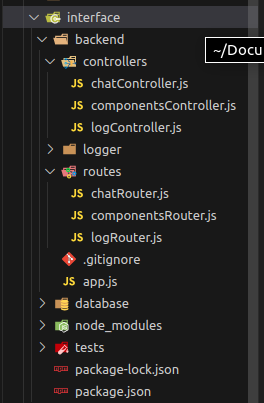

# Backend

Nesta seção, abordaremos a explicação do backend, desenvolvido utilizando [Node.js](https://nodejs.org/docs/latest/api/), um framework amplamente reconhecido para a construção de backends com JavaScript.

O principal objetivo do backend é atuar como um regulador, garantindo que todas as requisições feitas pelos usuários sejam devidamente processadas e encaminhadas para o destino adequado. Além de controlar a arquitetura de nós e os registros no banco de dados, o backend também gerencia o sistema de log, responsável por armazenar informações cruciais para a manutenção do sistema.

A meta principal é tornar o backend o mais escalável possível, desempenhando o papel de mediador. A arquitetura de nós é composta por um nó backend, nós LLM, STT, TTS, frontend e Nav2. A estrutura é projetada para garantir eficiência e coordenação entre esses elementos.

Optamos por um design simplificado para tornar a interface mais amigável, reconhecendo a praticidade de uma interface acessada por dispositivos móveis.

Além disso, entendemos o impacto significativo do mercado de aplicativos móveis na vida das pessoas, democratizando o acesso à tecnologia e ampliando o público atingido.

## Arquitetura de Backend

A arquitetura do backend segue o padrão do MVC, dividindo a estrutura em três camadas: models, views e controllers. Essa abordagem visa a clareza do sistema e, principalmente, o aumento da escalabilidade. Cada bloco da arquitetura é responsável por uma funcionalidade específica.

- **Models:** Esta pasta abriga a camada de modelos da aplicação, responsável pela manipulação dos dados. Aqui, são gerenciados e interagem com os registros do banco de dados, que está hospedado no Supabase.

- **Controllers:** Na pasta de controllers, encontramos a camada de controle da aplicação. Essa camada gerencia a comunicação entre as camadas, controlando as requisições do usuário e determinando quais terão impacto no banco de dados.

- **Routes:** Esta pasta concentra a camada de rotas da aplicação, responsável por gerenciar a interação do usuário com o backend. Serve como a porta de entrada para os registros do banco de dados, manipulando as chamadas dos controllers por meio das requisições do usuário, onde o usuário, nesse contexto, refere-se ao frontend, diretamente responsável pela interação com o usuário final.


<div style={{"margin": "0 auto", "max-width": "400px", "display": "flex", "justify-content": "space-around"}}>

<div style={{"padding-right": "30px"}}>



</div>
</div>


# Nós no backend

A aplicação foi projetada com o intuito de proporcionar uma experiência simples e intuitiva, alinhada com as práticas comuns do mercado. Ao iniciar a aplicação em um dispositivo móvel, o usuário é recebido pela tela inicial, que oferece exclusivamente a opção de iniciar o fluxo. Vale ressaltar que, devido à natureza mobile do aplicativo, os usuários podem realizar multitarefas, como atender chamadas, enquanto utilizam o programa.

### Interface principal
A interface principal conta com botões(tabs) que permitem a navegação entre diferentes páginas, cada uma com funcionalidades específicas:

1. **Chat:** Nesta página, o usuário pode acessar o chat, estabelecendo uma conversa com o assistente virtual. A integração com nosso backend desempenha o papel de administrador para os nós que compõem a arquitetura. Como exemplo, as mensagens enviadas pelo usuário são processadas por uma API que encaminha a solicitação ao nosso LLM.

2. **SAP:** Destinada à integração com o Sistema de Controle de Registros da Ambev (SAP), esta página oferece uma visualização em formato de dashboards. Os usuários têm acesso à disponibilidade de peças no almoxarifado, proporcionando uma ferramenta valiosa para gestores e técnicos acompanharem as operações.

3. **Saved:** Nesta página, o usuário pode acessar uma lista de itens salvos. Essa funcionalidade atua como uma espécie de lista de compras, mantendo registros dos itens que o usuário solicitou, mas que não estavam disponíveis no momento. O objetivo principal é facilitar a gestão e o acompanhamento de requisitos não atendidos.

O design do aplicativo busca não apenas eficiência operacional, mas também acomodar a realização de tarefas cotidianas pelos usuários, garantindo uma experiência fluida e conveniente.


Tela da aplicação em seu menu inicial:


### Comunicação com o Supabase

A interface do chat é projetada para facilitar a comunicação entre o usuário e a aplicação, incorporando as seguintes funcionalidades:

1. **Botões de Mensagem:** Na página de chat, o usuário pode interagir com o assistente virtual de diversas maneiras. Além de enviar mensagens, ele pode copiar o conteúdo das mensagens, marcar uma resposta como útil ou desfavorável e recarregar o chat para obter atualizações.

2. **Áudio:** A funcionalidade de áudio, representada pelo ícone de microfone no canto inferior direito, permite ao usuário enviar mensagens de voz para o sistema integrado. Quando ativado, o microfone envia a gravação de áudio para um nó de reconhecimento de fala (STT), que converte a fala em texto. Esse texto é então submetido ao sistema de síntese de fala (TTS) e posteriormente ao Modelo de Linguagem de Aprendizado Profundo (LLM). Esse processo possibilita a interação por meio de comandos de voz.


### Interface de Integração com o SAP

A interface de integração com o SAP foi desenvolvida para otimizar a comunicação entre o conteúdo da plataforma e as informações armazenadas no sistema SAP. Funcionando como um filtro inicial da aplicação, destaca visualmente as peças de manutenção que estão indisponíveis, marcando-as em cinza. Além disso, essa página é concebida como um "chat rápido", apresentando as peças presentes no histórico do usuário e oferecendo recomendações. O usuário pode ajustar a quantidade desejada desses itens sem necessariamente interagir com o chat, proporcionando uma experiência de "chat express".

Principais funcionalidades incorporadas:

1. **Filtro Primário e Chat Rápido:** Na página do SAP, o usuário tem a flexibilidade de interagir com o assistente virtual de diversas maneiras. Em situações de pedidos rápidos, onde a interação com o chat não é necessária, o usuário pode simplesmente clicar na peça recomendada ou presente no histórico, transformando essa ação em uma espécie de "chat express".

2. **Quantidade de Materiais Disponíveis no Estoque:** A funcionalidade de quantidade possibilita que o usuário visualize a quantidade de peças disponíveis no almoxarifado. Para aprimorar essa funcionalidade, está sendo considerada a implementação de notificações ao usuário quando uma peça adicionada ao carrinho não estiver disponível no estoque, garantindo uma experiência mais informativa e eficiente.


# Acessibilidade da aplicação
O design da interface destaca-se pela sua intuitividade e facilidade de uso, refletindo as cores e tipografia alinhadas à identidade visual do grupo Chauffeur, conforme apresentado em nossas demonstrações. A ênfase foi na adaptação para dispositivos móveis, proporcionando um fluxo de usuário descomplicado.

Quanto à usabilidade e acessibilidade da interface, é importante ressaltar que, atualmente, nenhum recurso foi implementado, dado que a aplicação ainda está em fase de desenvolvimento. No entanto, nosso roadmap inclui um plano estruturado para aprimorar a assistência oferecida pela aplicação. Uma das mudanças prioritárias envolve a personalização da interface web, visando tornar a experiência do usuário mais flexível e inclusiva, abordando diferentes perspectivas.

Estamos planejando implementar recursos que promovam acessibilidade, como opções de áudio, integrações com serviços dedicados e a inclusão de atributos "alt" em todas as imagens para fornecer descrições, garantindo uma experiência rica mesmo em casos nos quais as imagens não são renderizadas.

É importante salientar que a integração de todas as funcionalidades ao backend está em andamento, sendo desenvolvida de forma colaborativa. Questões relacionadas a essa integração serão abordadas em documentos futuros, à medida que avançamos no desenvolvimento do projeto.

## Execução do Backend

Para executar o backend do projeto, são necessárias algumas dependências. Siga os passos abaixo para garantir a correta execução da aplicação:

1. **Clone o repositório da aplicação do GitHub utilizando o seguinte comando:**
   ```
   git clone https://github.com/2023M8T2-Inteli/grupo6.git
   ```
   Execute este comando apenas se o projeto ainda não estiver clonado.

2. **Dirija-se ao diretório do repositório clonado, abra um terminal e execute o seguinte comando para instalar as dependências do Node.js:**
   ```
   npm i
   ```
   Este comando instala todas as dependências relacionadas ao Node.js e seus frameworks.

3. **Agora que todas as dependências estão instaladas, é necessário executar o backend. Navegue até o diretório 'interface' e execute o seguinte comando:**
   ```
   node backend/app.js
   ```

Após a execução deste comando, uma URL será exibida no terminal indicando que o backend está funcionando e pronto para cumprir seu papel.

Link do backend no github: https://github.com/2023M8T2-Inteli/grupo6/tree/dev/src/interface/backend
