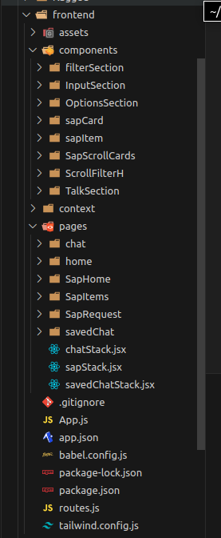

# Incremento da Interface Mobile

Anteriormente, apresentamos o protótipo da interface de usuário usando o Figma, conforme documentado. Na sprint 4, iniciamos o desenvolvimento da interface mobile utilizando [React Native](https://reactnative.dev).

O objetivo primordial da interface mobile é garantir a máxima intuitividade e acessibilidade. Além de promover aprendizado, buscamos criar uma interface gráfica portátil, otimizada para dispositivos com capacidade computacional limitada. Nosso principal propósito é integrar-se ao contexto da Ambev, aprimorando o fluxo de trabalho existente sem interrupções significativas, de modo a ser adotado por um amplo espectro de colaboradores. O processo no almoxarifado se concentra em permitir que os usuários façam pedidos por meio de seus celulares, dispositivos que estão presentes na maioria dos cenários da fábrica da Ambev, facilitando a requisição de peças de manutenção em diversos locais.

Optamos por um design simplificado para tornar a interface mais amigável. Reconhecemos que uma interface acessada por dispositivos móveis é mais prática, simplificando o processo para o usuário.

Além disso, reconhecemos o impacto significativo do mercado de aplicativos móveis na vida das pessoas. O que antes era exclusivo para a área técnica, a tecnologia móvel democratizou o acesso, transformando o cenário e impactando um público mais amplo.

# Arquitetura de Código
A arquitetura do frontend mobile segue o padrão do Next.js para aplicações web convencionais, organizada da seguinte maneira:

- **Components:** Esta pasta contém todos os componentes da aplicação, ou seja, os blocos que compõem as páginas.
  
- **Pages:** Aqui estão armazenadas todas as páginas compostas pelos componentes.

- **App.js:** Este arquivo renderiza todas as páginas na estrutura de uma aplicação web.


<div style={{"margin": "0 auto", "max-width": "400px", "display": "flex", "justify-content": "space-around"}}>

<div style={{"padding-right": "30px"}}>


</div>
</div>


Uma peculiaridade dessa arquitetura é sua semelhança com a lógica de desenvolvimento web convencional. No entanto, uma novidade para o grupo foi a estilização com CSS puro usando React. Para contornar isso, optamos por utilizar a biblioteca [Tailwind CSS](https://tailwindcss.com/docs/installation)
 para estilizar por meio de classnames. Essa escolha foi feita para acelerar a curva de aprendizado, uma vez que alguns membros do grupo tinham mais familiaridade com essa tecnologia.

Por fim, as bibliotecas para configuração dos passos posteriores:

- [React Native](https://reactnative.dev): Framework javascript para desenvolvimento mobile baseaado no [React](https://react.dev);
- [NativeWind](https://www.nativewind.dev): Framework css para desenvolvimento em react native baseado no [Tailwindcss](https://tailwindcss.com);
- [Expo](https://expo.dev): Framework para desenvolvimento mobile que compila e permite a execução do projeto e, também, o seu deploy.


# Fluxo de Uso da Aplicação Web


# Acessibilidade da aplicação

É notório o design intuitivo e de fácil uso. As cores condizem com a identidade visual do grupo, Chauffeur, tal como a tipografia usada nas nossas apresentações.  A interface foi projetada para satisfazer dispositivos móveis, com um fluxo de usuário simples.

No tocante a usabilidade e acessibilidade da interface, ainda há nada implementado, tendo em vista que ela ainda está em desenvolvimento. Porém, nosso roadmap contém um plano estruturado para tornar a aplicação cada vez mais assistiva. Por exemplo, uma de nossas mudanças prioritárias é a personalização da interface web, deixando a experiência do usuário mais personalizável e abrangendo diferentes perspectivas. Além disso, é planejado colocar alternativas para áudio, integrações com serviços de acessibilidade, em todas as imagens são colocados os argumentos "alt", para a descrição da imagem caso esta não renderize, etc.

Tendo isso em vista, ainda falta a integração de todas as funcionalidades ao backend que está sendo desenvolvido em conjunto. Futuramente essas questões de integração serão abordadas neste documento.

## Como executar

A execução do projeto requer algumas dependências, antes de iniciar, execute os seguintes comandos

```
npm i
```

Pronto, agora a lib Nodejs está toda instalada. Porém, ainda precisamos executar a interface mobile. Para isso, execute o seguinte comando:

```
npm expo start
```

A partir da execução desse comando, irá surgir um qr no terminal do usuário. Escanei o qr code com seu celular, permita a execução no seu celular e desfrute da experiência
